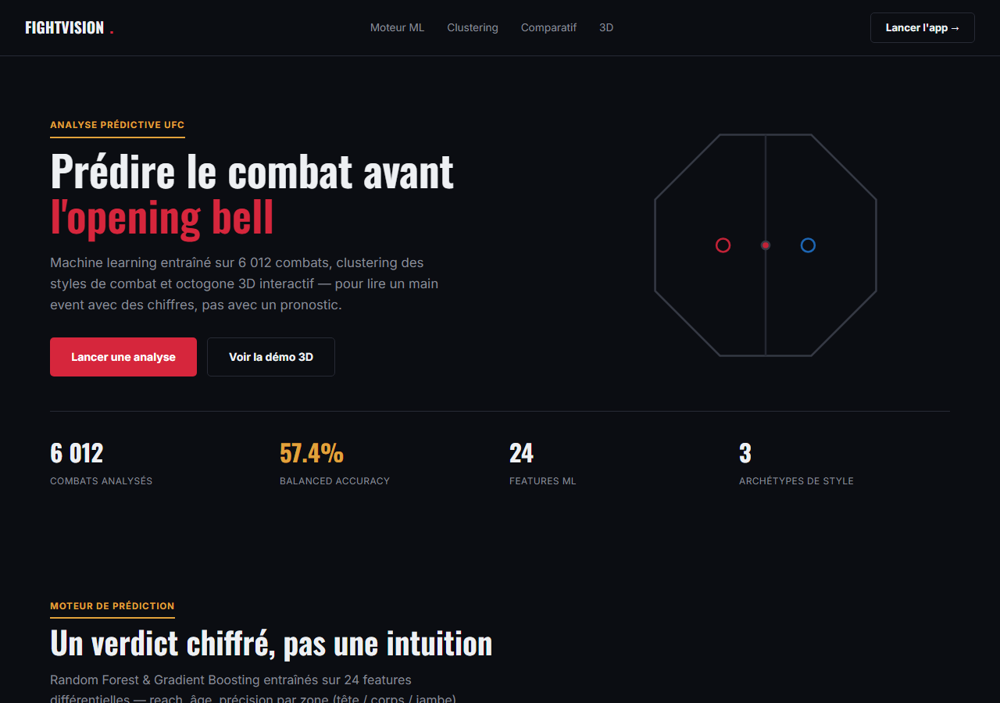
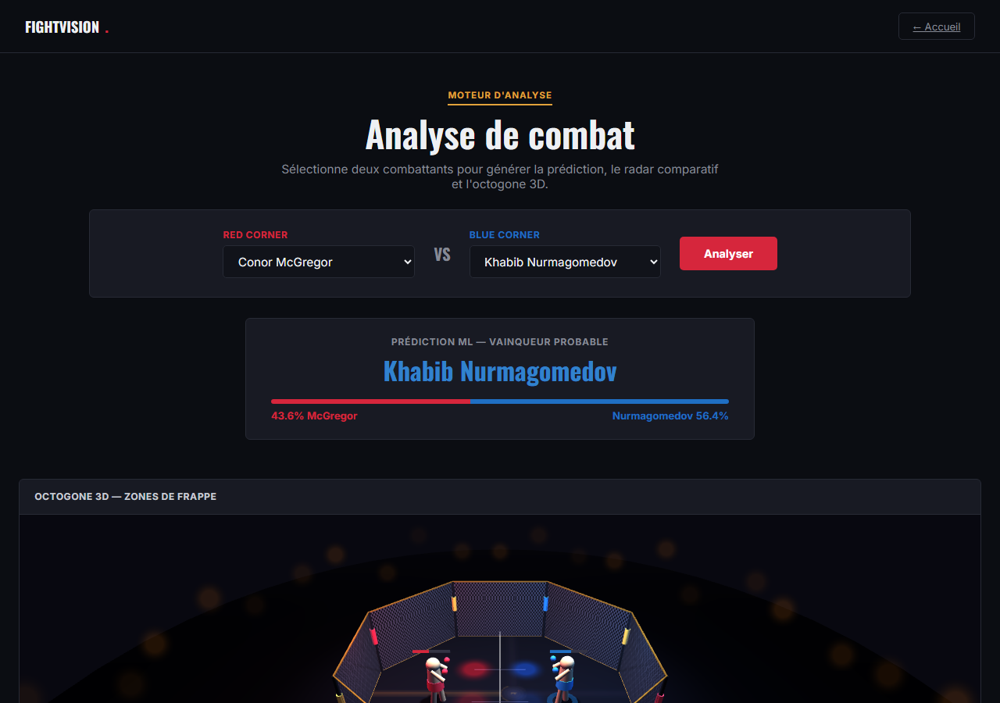
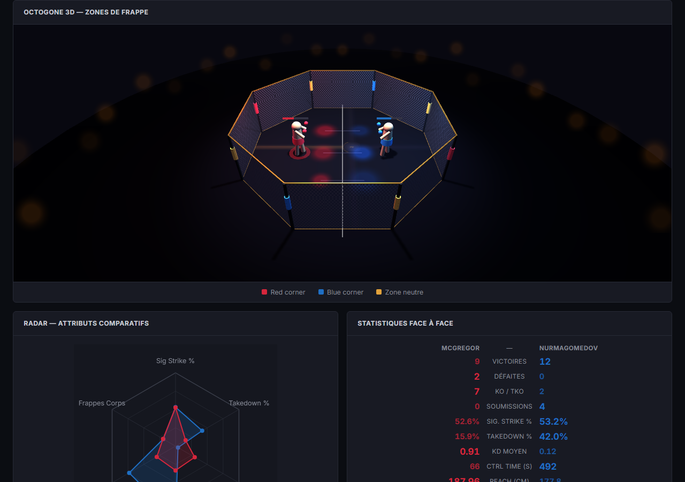

# FightVision — Prédiction de combats UFC & visualisation 3D

Analyse prédictive de combats UFC (machine learning) couplée à une visualisation 3D interactive de l'octogone, construite comme projet académique (IGRV + IA, ENP Alger) puis retravaillée comme pièce de portfolio.

## Pourquoi ce projet

La plupart des projets ML "qui prédisent un sport" s'arrêtent au notebook avec un score d'accuracy. Celui-ci va plus loin sur deux points précis :

- **Rigueur de l'évaluation, pas juste un chiffre.** Le dataset brut est déséquilibré : le coin *Red* gagne 67% des combats (il correspond historiquement au favori). Un modèle entraîné naïvement atteint 68% d'accuracy en prédisant quasi toujours Red — un score flatteur mais trompeur (recall de 16% sur les victoires Blue). Le projet documente ce biais et le corrige par une augmentation des données par inversion de coin (R↔B), qui rééquilibre les classes et fait chuter l'accuracy brute à 63% — la vraie balanced accuracy passe elle de ~55% à 57.4%. Voir [Modèle ML](#modèle-ml) et [Limites connues](#limites-connues--pistes-damélioration).
- **De la donnée à l'interactif, sans framework.** Pipeline complet : `data.csv` (6 012 combats) → feature engineering Python → modèle scikit-learn → export JSON → interface web (radar Canvas 2D + octogone 3D Three.js) en HTML/CSS/JS natif, sans étape de build.

## Aperçu

| Landing page | Application |
|---|---|
|  |  |



## Fonctionnalités

- Sélection de deux combattants → prédiction du vainqueur probable avec probabilités
- Octogone 3D interactif (Three.js) : cage grillagée, combattants animés, heatmap des zones de frappe (tête/corps/jambe), caméra pilotable à la souris
- Radar comparatif (Canvas 2D) sur 6 attributs normalisés
- Tableau de statistiques face-à-face avec mise en évidence du meilleur stat par ligne
- Modèle ML entraîné en Python (Random Forest / Gradient Boosting) avec rapport de classification, matrice de confusion et feature importance

## Stack technique

| Couche | Outils |
|---|---|
| Data & ML | Python, pandas, scikit-learn, matplotlib/seaborn, joblib |
| Frontend | HTML / CSS / JavaScript natifs (aucun framework, aucun build step) |
| Visualisation 3D | Three.js (r128) |
| Données | CSV → JSON (`fighters.json`) consommé directement par le navigateur |

## Structure du projet

```
fightvision/
├── data.csv              # Dataset UFC (6 012 combats, 144 colonnes)
├── requirements.txt      # Dépendances Python
├── jour1_model.py        # Feature engineering + entraînement ML
├── cluster_styles.py     # Clustering K-Means des styles de combat
├── fighters.json         # Profils des fighters exportés pour le frontend
├── landing.html           # Page d'accueil / présentation
├── index.html             # Application (sélection, prédiction, 3D)
├── screenshots/            # Captures d'écran utilisées dans ce README
└── outputs/
    ├── model.pkl              # Modèle entraîné (généré par jour1_model.py)
    ├── model_results.png      # Matrice de confusion + feature importance
    ├── clustering_results.png # Projection PCA + profil des centroïdes
    └── fight_*.png            # Figures de combat générées
```

## Démarrage rapide

### 1. Entraîner le modèle

```bash
pip install -r requirements.txt
python jour1_model.py
```

Charge `data.csv`, construit 24 features différentielles, entraîne Random Forest et Gradient Boosting avec augmentation par inversion de coin, puis sauvegarde le meilleur modèle dans `outputs/model.pkl` et les graphiques dans `outputs/model_results.png`.

### 2. Clustering des styles (optionnel)

```bash
python cluster_styles.py
```

Lit `fighters.json`, regroupe les fighters par style via K-Means et réécrit `fighters.json` avec les champs `cluster`/`style` par fighter. Génère `outputs/clustering_results.png`. À relancer si `fighters.json` est régénéré.

### 3. Lancer l'application web

```bash
npx serve .
```

Puis ouvrir `landing.html` (présentation) ou `index.html` (application). Un serveur HTTP local est nécessaire : `fetch('fighters.json')` échoue si on ouvre les fichiers directement en `file://`.

## Modèle ML

| Modèle | Configuration |
|---|---|
| Random Forest | 200 arbres, max_depth=8 |
| Gradient Boosting | 200 estimateurs, learning rate 0.05, max_depth=4 |

**Features (24) :** différentiels reach/taille/âge/wins/win_streak/KO/sub, stats de frappe (sig. strike %, takedown %, KD moyen, ctrl_time), précision par zone (tête/corps/jambe pour chaque coin), stance.

**Performance (après correction du biais de coin) :**

```
Accuracy : 63.3%   Balanced accuracy : 57.4%   Macro F1 : 0.58
              precision   recall
   Blue Win      0.43      0.41
   Red Win       0.72      0.74
```

Le dataset brut est déséquilibré (Red gagne 67% des combats). Sans correction, un modèle atteint 68% d'accuracy en prédisant presque toujours Red (recall Blue ~16%) — un score trompeur, dû au fait que le coin Red est historiquement assigné au favori plutôt qu'à une vraie information de niveau. L'augmentation par inversion de coin (chaque combat d'entraînement est dupliqué avec R et B inversés et les features différentielles négées) rééquilibre parfaitement les classes et force le modèle à apprendre une différence de niveau réelle plutôt qu'un artefact du dataset.

57% de balanced accuracy reste modeste (à peine au-dessus du hasard) — ce qui reflète la difficulté réelle de prédire un combat à partir de stats agrégées seules, plutôt qu'un bug.

## Clustering des styles de combat

`cluster_styles.py` regroupe les fighters par style via **K-Means**, à partir de 9 stats de profil (précision de frappe par zone tête/corps/jambe, takedown %, KD moyen, ctrl_time, taux de KO et de soumission par victoire) — pas par catégorie de poids ni par réputation.

- **k=3 n'est pas une supposition** : testé de k=2 à k=6, c'est la valeur qui maximise le silhouette score (0.173, sur les 851 fighters ayant ≥3 combats).
- **Les libellés viennent des centroïdes réels**, pas d'une intuition a priori (voir `outputs/clustering_results.png`) :

  | Style | Part (fighters ≥3 combats) | Signature statistique |
  |---|---|---|
  | Grappler / Finisseur au sol | 43% (366) | Takedown % et ctrl_time les plus hauts, taux de soumission le plus élevé (37%) |
  | Frappeur volumineux | 30% (253) | Volume de frappes le plus haut sur les 3 zones, ctrl_time élevé |
  | Frappeur explosif | 27% (232) | Taux de KO le plus haut (66%), KD moyen le plus élevé, le moins de ctrl_time |

- **Un résultat volontairement gardé tel quel parce qu'il est révélateur** : Khabib Nurmagomedov — l'archétype du wrestler — se classe « frappeur volumineux », pas « grappler ». Le modèle regarde le volume de frappes au sol (très élevé chez lui en ground-and-pound) et son faible taux relatif de finitions par soumission, pas le takedown en tant que tel. C'est le genre de nuance qu'une étiquette commerciale aurait lissée.
- Silhouette score modeste (0.17) : les styles réels se chevauchent, ce ne sont pas des catégories strictes — attendu pour des données de combat agrégées.
- Les fighters avec moins de 3 combats ne servent pas à entraîner le modèle (signal trop bruité) mais reçoivent quand même un style estimé via le modèle déjà fitté, pour que l'app puisse afficher un tag sur tous les profils.

Le résultat est écrit dans `fighters.json` (champs `cluster` et `style`) et consommé à la fois par `index.html` (tableau de stats) et `landing.html` (section clustering).

## Visualisation (IGRV)

**Radar chart (Canvas 2D)** — comparaison de 6 attributs normalisés entre les deux fighters.

**Octogone 3D (Three.js)** — modélisation de l'octogone (cage grillagée, poteaux, tapis texturé), combattants animés en position de garde, heatmap des zones de frappe au sol, caméra pilotable à la souris.

## Limites connues & pistes d'amélioration

Pour rester honnête sur l'état actuel du projet :

- **La prédiction affichée dans `index.html` est une heuristique JavaScript**, pas le modèle scikit-learn entraîné par `jour1_model.py` — les deux ne sont pas connectés. Pour une vraie démo ML, il faudrait soit transpiler le modèle entraîné en JS (ex. [m2cgen](https://github.com/BayesWitnesses/m2cgen)), soit précalculer les prédictions pour toutes les paires de fighters et les exporter avec `fighters.json`.
- **Licence du dataset non vérifiée.** `data.csv` doit être vérifié avant publication/redistribution publique si sa source impose des restrictions.
- **Pas de licence de code définie.** À ajouter (ex. MIT) avant de rendre le dépôt public si vous souhaitez en autoriser la réutilisation.
- Pas de tests automatisés ni de CI.
- Le rouge/bleu comme seul code couleur des coins est peu accessible aux daltoniens.

## Exemples de fighters dans le dataset

```
Conor McGregor, Khabib Nurmagomedov, Jon Jones, Israel Adesanya,
Dustin Poirier, Leon Edwards, Nate Diaz, Amanda Nunes...
```

## Auteur

Abdessamed — ENP Alger, M2 data science & AI  
Projet : Informatique Graphique et Réalisation Virtuelle (IGRV)
